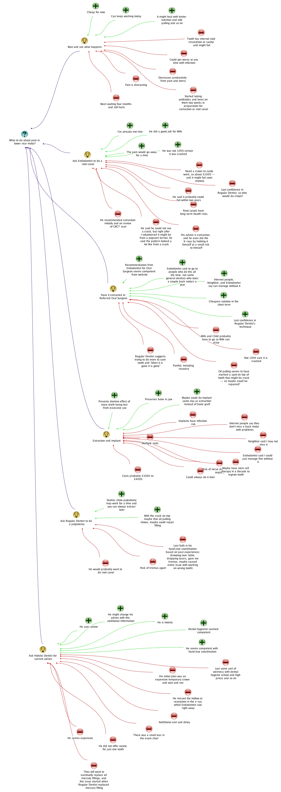

Heart disease and cancer are such complex and emotional topics they are hard to start with as motivational examples. They are just overwhelming for anyone to deal with. So, here is a simpler initial example of a health issue (a tooth ache) that the initial project committer faced and used Compendium to help make sense of and help make decisions about.

As long as this simple example is, it has still been somewhat simplified. If a tooth ache can cause this much confusion and stress, how much more confusing and stressful could larger and more immediately life threatening health issues like heart disease and cancer be to make sense of and decide about? The conflicts and uncertainties outlined here (including uncertainty about what health care provider to trust in what capacity) are likely typical of what many people may face when they try to interact with a health care system in an informed way with any significant health issue.

The initial project committer consulted the dentist he had been seeing regularly for about a decade in response to increasing tooth pain in a rear jaw area. That area previously had two large amalgam fillings that dentist had replaced with white fillings because that dentist said they were "breaking down" (even though they hadn't caused him any substantial pain at the time). This dentist was near retirement, had always been a tremendously nice person, and did not charge that much. This dentist was unable to determine with certainty which specific tooth of about three was the source of the pain, and said he could not find any problems with two white fillings he had placed in that area. 

Still in pain, and because he figured his dentist might retire soon, he then consulted a second dentist he had never seen before. This was a "holistic" dentist who did not like root canals. This second dentist said a specific tooth was the issue and advised an (expensive) temporary crown on a molar (without a root canal) for the tooth to see if it would heal on its own ($900 or so for temporary crown plus placing it), with a planned permanent crown to follow (over US$2000 in total for both crowns). It was unclear what that dentist would do if the temporary crown did not help. However, the second dentist could not perform the work right away because he was going to a dental conference just then. 

With continually increasing pain, and some reservations about the expensive crown suggestion, he had some inexpensive dental work done with his regular dentist to replace a questionable filling just in case in the third of that row of back teeth (but it did not help). 

Still in pain, he then decided on his own to see an endodontist (a specialist in internal tooth issues). Picking an endodontist was itself a challenge, and he then asked his first dentist for a referral to the one selected. The endodontist made a first guess that an extraction would be required from X-rays which seemed to indicate "resorption" in the tooth the second dentist had suspected, but suggested a diagnostic CBCT X-ray scan to help confirm his initial opinion. Based on the CBCT scan (itself an X-ray health risk and an additional expense and delay), in the first couple of minutes of looking at it, the endodontist suggested that the tooth could be an OK candidate for a root canal. However, while continuing to look at the CBCT scan results, the endodontist then revised that opinion after more information volunteered about a possible precipitating event before the pain of biting on a popcorn kernel. Ultimately the endodontist said he could not see a specific crack in the tooth from x-rays, but he felt a crack was likely present anyway in his experience based on the pattern of internal decay in the tooth (now thought to be decay moving upward from a cracked root and not from resorption). Because a substantial crack would mean a root canal would likely fail in under a year, the endodontist recommended a tooth extraction and provided a referral to an oral surgeon to do that. The endodontist took a dim view of the holistic dentist's advice to have a crown without a root canal in this case.

Returning to the original dentist and presenting the endodontist's finding, he heard the original dentist he had trusted for a decade suggest that he get a root canal anyway with a new white filling (not a crown) since "once a tooth is gone, it's gone". The general dentist also strongly disagreed that decay could come from the bottom of a tooth upwards, saying decay always came from the top down.

What to do with three differing opinions from three licensed dental professionals (temporary crown and then permanent, extraction, root canal with white filling)? To be clear, none of the practitioners mentioned here are being accused of anything. The point is more that the three essentially disagreed in what might be reasonable ways based on their own experiences, examinations, test results, priorities, and standards of practice (or at least could be seen to do so). 

Consulting the internet about this quandary (including considering the option to wait and see while trying home remedies to repair the tooth) led to even more uncertainty given various disagreements about root canals, crowns, fillings, implants, [dentists' lack of integrity](http://www.areturntoempathy.com/how-honest-are-dentists.html) vs. [high integrity](http://www.dentaleconomics.com/articles/print/volume-87/issue-4/departments/viewpoint/lets-review-how-readers-digest-misrepresented-us.html), general dentists vs. endodontist success rates for root canals, nutrition, oil pulling, herbal remedies, toothpastes, and more -- making a decision even harder. Talking with friends and family about the issue also led to more conflicting opinions to consider.

So, what do you do when you are in pain, have three disagreeing medical opinions, have an ocean of potentially biased non-specific conflicting background information from the internet, have conflicting advice from friends and family -- and yet also have limited time and money for getting yet more professional opinions and more test results (assuming that would really help anyway)? How do you decide which health-practitioner-recommended treatment to go with? What heuristics do you follow for weighing the different opinions? How do you think through resolving such a conflict (especially when you may be in enough pain from a health issue not to be able to easily think clearly)?

Given his previous familiarity with Compendium and IBIS, creating an IBIS map about this situation in Compendium proved useful to him to help make a decision in the face of uncertainty, costs, risks, and various conflicts-of-interest by different advice givers. The IBIS map was reviewed with a thought in mind suggested by a dental hygienist of considering who you trust the most (although that was not the only consideration). Even though he lost some work time and had some suffering from the issue and the related uncertainty, the original project committer is very thankful he has not had to make an IBIS map for dealing with a diagnosis of heart disease or cancer -- but he can see the potential value in doing that and more if needed. He hopes that reflecting on this example health issue more deeply could lead to better tools for health decision support, and that such tools could then be improved further to deal with much more challenging situations like dealing with cancer, heart disease, stroke, or other generally far more life-altering health issues (even as it is true that some tooth aches can cause death like through systemic infection and heart damage).

